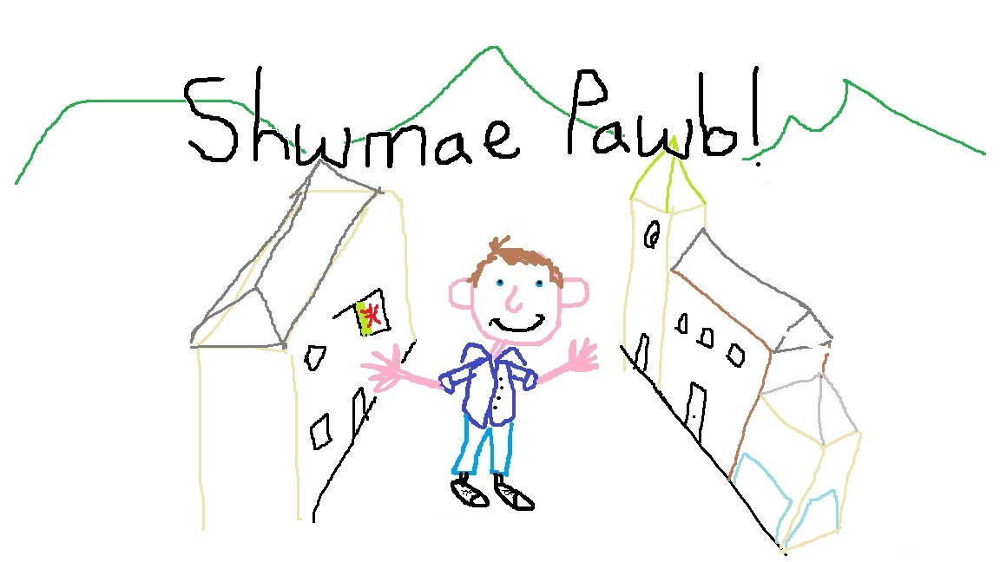

# Cashewe

I'm John, an AI / MLOps engineer from South Wales. I use this github organisation to store my rust / python products that go beyond simple experiments. My main interest is in exploring simple ergonomic tools within the AI and ML space, so expect to primarily see this type of content. As an equal act of pride and rebellion, all tools will be given Welsh names.

You can find more from me at the following links!

- [linkedin](www.linkedin.com/in/john-stokes-87b481190)
- [blog](https://cashewe.github.io/)
- [github (personal)](https://github.com/JohnStokes228)
- [dev.to](https://dev.to/johnstokes228) (same content as blog)
- [medium](https://medium.com/@johnstokes_38682) (same content as blog)

## My tools

### Darn - The mathematically optimal chunker

### Adran - The context rehydrator

### Llun - The architectural linter (experiment, not recommended for use)

